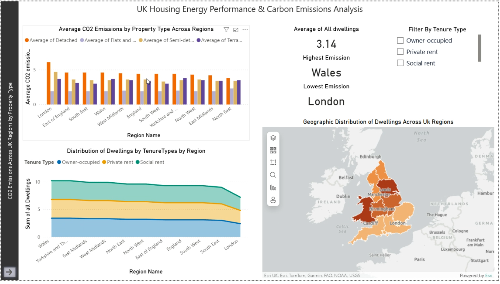
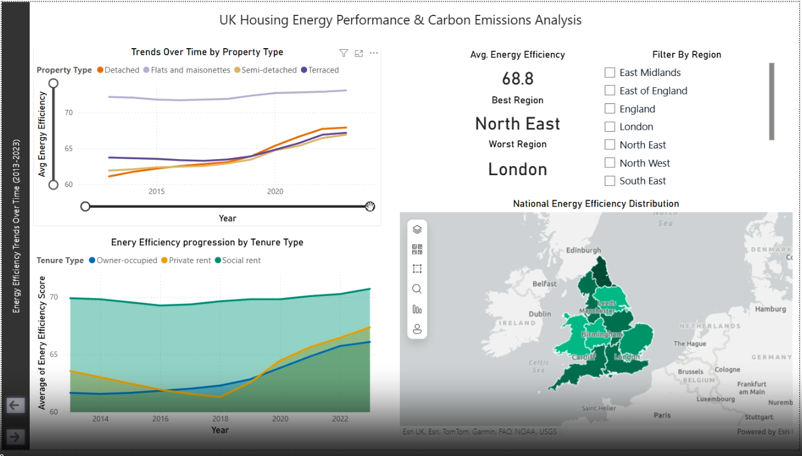

# UK Energy Efficiency & CO2 Emissions Dashboard


## Overview
This repository contains a Power BI dashboard developed to analyse energy consumption and carbon dioxide (CO2) emissions across the United Kingdom. By segmenting data by property type, tenure, and geographic location, this project aims to uncover patterns in the UK’s carbon footprint and in the evolution of housing energy efficiency from 2013 to 2023.

This project was completed as part of the **CSC8626 - Data Visualisation** module.

## 📊 Dashboard Features

The interactive dashboard is designed around three core analytical tasks:

### 1. Geospatial Analysis (Location Task)
* **Visuals:** Choropleth maps and bar charts.
* **Insight:** Highlights regional CO2 emission "hotspots." The map uses colour intensity gradients to quickly communicate emission levels across different UK regions. For instance, the data reveal that detached properties in London have the highest average emissions (~6.1 tonnes of CO2/year), whereas flats have significantly lower emissions (~1.9 tonnes/year).
* **Interactivity:** Filters by tenure type allow users to observe how ownership patterns influence emission levels geographically.

### 2. Temporal Trends (Time Task)
* **Visuals:** Line charts and stacked area charts.
* **Insight:** Tracks the steady improvement in average energy efficiency scores between 2013 and 2023. It highlights how different property types progress (e.g., flats leading with scores above 73, while detached houses progress from ~61 to 68). It also contrasts efficiency trends by ownership structure, showing that social rent properties maintain high efficiency while owner-occupied/privately rented homes are catching up.
* **Interactivity:** A year-range slider and regional filters enable users to drill down into short-term, long-term, and localised performance.

### 3. Multidimensional Relationships (Correlation Task)
* **Visuals:** Interactive scatter plot.
* **Insight:** Reveals the correlation between energy efficiency (x-axis) and CO2 emissions (y-axis), categorised by property type (colour-coded) and location. The plot demonstrates a clear negative trend: as energy efficiency increases, emissions decrease.
* **Interactivity:** Users can filter by region and tenure to see how local conditions manipulate this correlation.

## 🎨 Design & Visualization Principles
The dashboard was built adhering to core data visualisation theories:
* **Colour Theory:** Utilised the ColorBrewer palette to ensure accessibility for colorblind viewers. Distinct, consistent colour schemes are used for property types (orange for detached, lavender for flats, tan for semi-detached, navy for terraced).
* **Visual Hierarchy & Simplicity:** Typography, spacing, and white space are utilised to minimise clutter. Visuals are arranged in a logical reading order to guide the user's eye naturally.
* **Clear Annotations:** Concise text, clear headings, and consistent legends ensure the data is easily interpreted by a non-technical audience.

## 📸 Dashboard Preview

<p align="center">
  
  
</p>

## 📁 Repository Structure
```text
├── data/
│   ├── 15energyconsumptionbyindustry.xlsx
│   ├── energyefficiencyofhousingenglandandwalesfiverollingyearsuptomarch2023.xlsx
│   ├── individualenergyperformancecertificateepcbandsenglandandwalesuptomarch2023.xlsx
│   └── medianestimatedcarbondioxideco2emissionsenglandandwalesuptomarch2023.xlsx
├── dashboard/
│   └── Shubham_Parab_250476264_Coursework_Powerbi.pbix
├── docs/
│   ├── Coursework_Instruction.pdf
│   └── Description_Sheet.pdf
├── assets/
│   ├── dashboard1.png
│   └── dashboard2.png
└── README.md
```

## 🚀 How to Use
1. Clone this repository to your local machine.
2. Ensure you have [Power BI Desktop](https://powerbi.microsoft.com/desktop/) installed.
3. Open the `Shubham_Parab_250476264_Coursework_Powerbi.pbix` file located in the `dashboard/` folder.
4. Use the on-screen filters, navigation tabs, and timeline sliders to interact with the data.

## 📚 References & Data Sources
Data for this project were sourced primarily from the Office for National Statistics (ONS).

* Office for National Statistics (ONS). (2024). *Energy efficiency of housing in England and Wales: 2024*.
* Office for National Statistics (ONS). (2025). *Measuring UK greenhouse gas emissions*.
* Department for Levelling Up, Housing and Communities. *Energy Performance Certificate data on Open Data Communities and Valuation Office Agency - Property Attributes data*.
* Department for Levelling Up, Housing and Communities. (2023). *English housing survey 2022 to 2023: Energy report*.
* Brewer, C. A., & Harrower, M. (2003). ColorBrewer.org: An online tool for selecting colour schemes for maps. *Cartography and Geographic Information Science*, 30(1), 67–73.

---
**Author:** Shubham Parab
